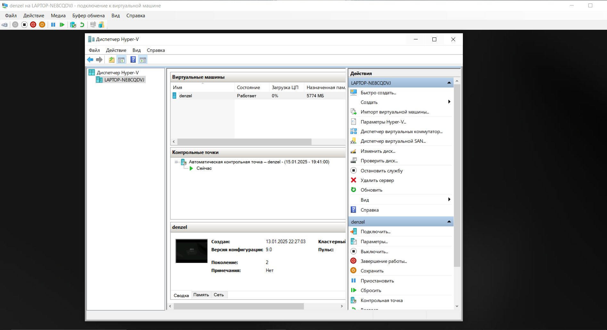
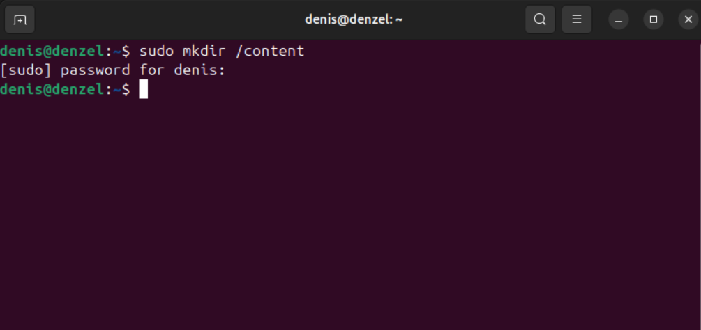
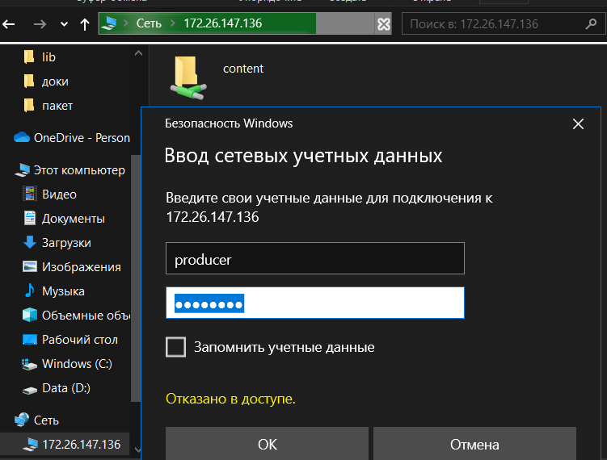
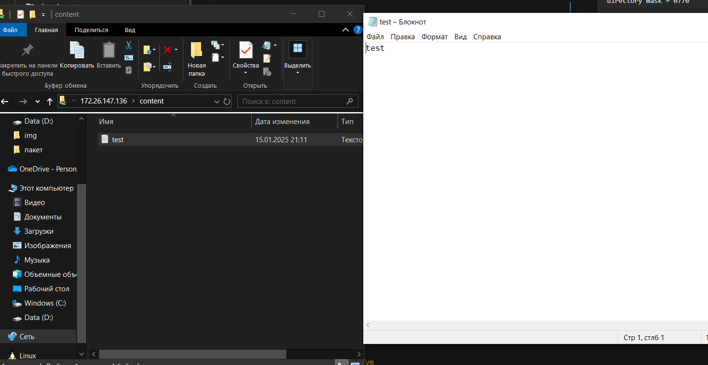
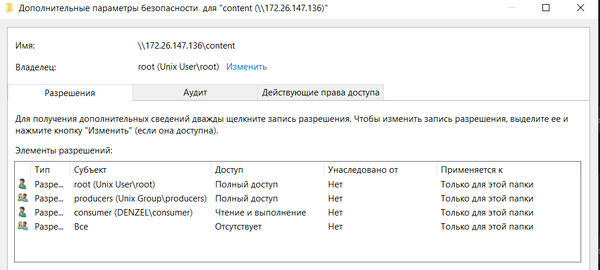

# Задание

1. Создать виртуальную машину в Hyper-V

2. Создать две роли:
	- **Producer**: имеет права на чтение и запись в папке `/content`.
	- **Consumer**: имеет права только на чтение и выполнение файлов в папке `/content`.

3. Настроить раздельный доступ для ролей

---

# Решение

## 1. Создание виртуальной машины в Hyper-V

1. Использовался Hyper-V Manager.
   
2. Настройка параметров виртуальной машины:
	- Название: `denzel`.
	- Количество ядер процессора: 2.
	- Оперативная память: 8 ГБ.
	- Жесткий диск: 40 ГБ.
	- Установлена Ubuntu через ISO-образ.

---

## 2. Настройка папки `/content` на Ubuntu

1. Создание папки:
   
2. Создание пользователей:
```bash
    sudo adduser producer
    sudo adduser consumer
```
3. Создание групп для разделения доступа:
```bash
    sudo groupadd producers
    sudo groupadd consumers
```
4. Добавление пользователей в соответствующие группы:
```bash
    sudo usermod -aG producers producer
    sudo usermod -aG consumers consumer
```
5. Настройка прав доступа.

   Изменение владельца папки content:
```bash
    sudo chown root:producers /content
```
Настройка прав доступа для папки:
```bash
    sudo chmod 770 /content # Полный доступ для producer
    sudo setfacl -m u:consumer:rx /content # Только чтение и выполнение для consumer
```
## 3. Настройка раздельного доступа для ролей
1. Установка Samba:
```bash
    sudo apt install samba
```
2. Добавление пользователей в Samba:
```bash
    sudo apt install samba
```
3. Настройка конфигурации Samba
- Открытие файла конфигурации:
```bash
    sudo nano /etc/samba/smb.conf
```
- Добавление следующих секций:
```ini
[content]
path = /content
valid users = producer, consumer
read only = no
force group = producer_group
create mask = 0770
directory mask = 0770

[readonly]
path = /content
valid users = consumer
read only = yes
force group = consumer_group
create mask = 0750
directory mask = 0750
```
- Доступ под ролью `producer` из основной ОС и создание тестового файла 


- Информация о разделение ролей

